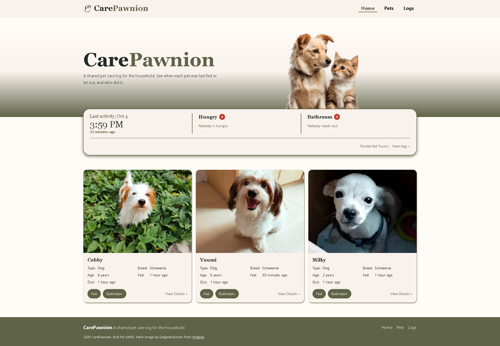

# CarePawnion

A shared pet care log for households, so everyone can see when each pet was
last fed, walked, or let out, and who did it.

**Live site:** https://carepawnion.pages.dev (invite only, see [Access](#access))
**API:** https://carepawnion.onrender.com/healthz
**Demo video:** (link)

This project was built with help from Claude by Anthropic. See
[AI-USAGE.md](AI-USAGE.md) for how it was used, where it got things wrong, and
which parts I wrote myself.

## What it does

- See every pet in the household with the time of its last feeding and last
  bathroom trip
- See at a glance which pets are hungry or need to go out, on the Home screen
- Add, edit, and remove pets, with a photo, breed, and birthday
- Log a feeding, walk, pee, or poop, tagged to the member who did it
- Keep a record of vaccinations and vet checkups, with next due dates
- See each pet's usual times for feeding and bathroom trips, based on past logs

## Built with

React and Vite on the front end, Express and PostgreSQL on the back end. The
client is on Cloudflare Pages, the API on Render, and the database on Neon.

## Demo mode

This repository can run two ways, chosen by one environment variable at **build**
time.

**Demo mode is the default.** Only the exact string `false` turns it off, so a
forgotten or mistyped variable leaves you on the simulated backend with a visible
notice rather than on a silently broken build.

| `VITE_USE_MOCK_API` | What happens |
| --- | --- |
| unset, or `true` | The client answers its own requests from `localStorage`. No server, no database, nothing shared between visitors. |
| `false` | The client calls the Express API at `VITE_API_BASE_URL`, which reads and writes real PostgreSQL. |

The live site runs with `VITE_USE_MOCK_API=false`, so it uses the real API and
database. Demo mode stays as a fallback in case the free API host is asleep
during a demo.

## Running it yourself

**The client only, in demo mode.** No database needed.

    cd client
    npm install
    cp .env.example .env        # VITE_USE_MOCK_API stays true
    npm run dev                 # http://localhost:5173

**The whole stack.** Needs a PostgreSQL database, either local or hosted. This
project uses a free Neon database.

    # 1. the database
    # Create a project on neon.tech and copy its connection string.
    # Or run one locally with Docker
    docker run --name my-pg -e POSTGRES_PASSWORD=devpassword \
      -e POSTGRES_DB=carepawnion -p 5432:5432 -d postgres:17

    # 2. the API
    cd server
    npm install
    cp .env.example .env        # put the connection string in DATABASE_URL
    npm run db:reset            # creates the tables and adds sample rows
    npm run dev                 # http://localhost:3000

    # 3. the client, in another terminal
    cd client
    npm install
    cp .env.example .env
    # set VITE_USE_MOCK_API=false
    npm run dev

Check the API on its own before you blame the client.

    curl http://localhost:3000/healthz     # is the process alive
    curl http://localhost:3000/readyz      # is the database reachable
    curl http://localhost:3000/api/pets
    curl http://localhost:3000/api/logs

## Environment variables

None of these are committed. `.env.example` in each folder lists them with
placeholder values.

| Name | Where | What it is |
| --- | --- | --- |
| `DATABASE_URL` | server | PostgreSQL connection string. Contains a password |
| `CORS_ORIGINS` | server | comma-separated origins allowed to call the API, matched exactly |
| `NODE_ENV` | server | `production` on the host |
| `PORT` | server | **set by the host**, do not set it yourself |
| `VITE_USE_MOCK_API` | client, at build time | only `false` turns demo mode off; unset means on |
| `VITE_API_BASE_URL` | client, at build time | the API's public URL, no trailing slash |

Every `VITE_` value is compiled into the built JavaScript and is **public**.
Never put a key, a password or a connection string in one.

## Deploying

**Database, on Neon.** Create a project, copy the connection string into
`server/.env`, then run `npm run db:reset` once from the `server` folder to
create the tables.

**API, on Render.** A Web Service connected to this repository.

| Setting | Value |
| --- | --- |
| Root Directory | `server` |
| Runtime | Node |
| Build Command | `npm install` |
| Start Command | `npm start` |

Set `DATABASE_URL`, `CORS_ORIGINS` (the Cloudflare Pages link), and
`NODE_ENV=production` in the Render dashboard. After changing a variable, use
**Save, rebuild, and deploy** so the API restarts with it. The free tier sleeps
when idle, so the first request after a while can take up to a minute.

**Client, on Cloudflare Pages.** A Pages project connected to this repository.

| Setting | Value |
| --- | --- |
| Framework preset | React (Vite) |
| Root directory | `client` |
| Build command | `npm run build` |
| Build output directory | `dist` |

Set `VITE_USE_MOCK_API=false` and `VITE_API_BASE_URL` (the Render link) under
**Settings > Variables and Secrets**. These are read at build time, so retry the
deployment after changing them.

Pushing to `main` redeploys on its own. Changes in `client/` rebuild the site on
Cloudflare, and changes in `server/` redeploy the API on Render. Changes to
`schema.sql` are not applied on their own and need to be run against Neon.

The GitHub Pages workflow in `.github/workflows/deploy-pages.yml` is still in
the repository from the template, and publishes a demo mode copy of the client.

## Access

The live site is behind Cloudflare Access, for both `carepawnion.pages.dev` and
its preview links. Only emails on the access policy can open it. Visitors enter
their email and get a one-time login code, so there are no passwords to keep.
To add someone, add their email to the Include rule of the policy in
Cloudflare One, under **Access controls > Applications**.

The security checks for this project are in
[SECURITY-CHECKLIST.md](SECURITY-CHECKLIST.md).

## Project structure

    client/          React front end, built by Vite
      src/api/       ONE interface, two implementations, chosen by a variable
      src/components/
      src/pages/
    server/          Express API
      db/            pool, schema.sql, seed.sql, and a runner for them
    compose.yml      only if you self-host
    docs/            planning documents and weekly reports

## Architecture

The React client is served from Cloudflare Pages, behind Cloudflare Access, so
only invited emails can open it. It calls the Express API on Render, and only
the Cloudflare Pages origin is allowed through CORS. The API
reads and writes a PostgreSQL database on Neon over an encrypted connection.
Each piece is deployed from the same GitHub repository.

## What I would do next

- Put the API behind the same gate, since Access only covers the client and a
  direct request to Render can still change data
- Connect to Neon with a role that can only read and write `pets` and `logs`,
  instead of the owner role
- Turn off the GitHub Pages demo copy, so there is only one link
- Save a separate note for each activity type, since logging several types at
  once copies the same note to every log

## Author

Randel Angelo L. Yumul — https://github.com/RandelYumul
HAU 6APSI, CS-402

## Licence

MIT, see [LICENSE](LICENSE).